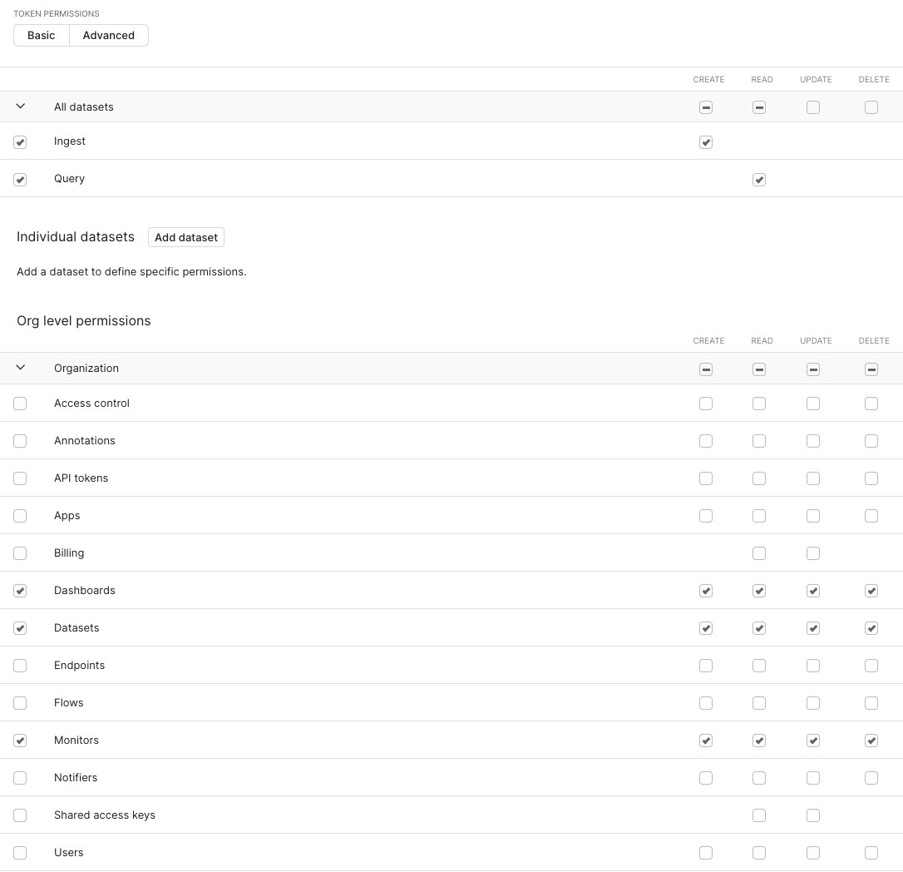

<!--
title: Serverless Framework - Axiom Observability
description: How to configure observability for your Serverless Framework services using Axiom
short_title: Axiom
keywords: ['Serverless Framework', 'Observability', 'Monitoring', 'Axiom']
-->

<!-- DOCS-SITE-LINK:START automatically generated  -->

### [Read this on the main serverless docs site](https://www.serverless.com/framework/docs/guides/observability/axiom)

<!-- DOCS-SITE-LINK:END -->

# Axiom

Axiom is a powerful observability platform that enables efficient handling, storage, and querying of extensive event data. It offers a cost-effective solution for log management and analytics, ensuring comprehensive visibility across your applications. Axiom allows you to capture, analyze, and visualize logs, metrics, and traces, providing essential tools for monitoring and troubleshooting your serverless applications.

## Enabling Axiom Observability

### Step 1: Create an Axiom account and access token

1. If you don't already have an Axiom account, sign up at [https://app.axiom.co/register](https://app.axiom.co/register). Axiom offers a free tier that allows you to get started with the platform.
2. Create or join an organization in Axiom.
3. Skip the first step (creating dataset) in the Axiom onboarding process, as it will be done automatically by the Serverless Framework.
4. Go to [API tokens in the Axiom settings](https://app.axiom.co/settings/api-tokens) and create a new access token
with the `Ingest`, `Query`, `Datasets`, `Dashboards`, and `Monitors` using the Advanced tab.
   Store the token value securely as you will need it in the next steps.
   The Serverless Framework will use it to send logs to Axiom.


### Step 2: Configure Axiom in your Serverless Framework service

Add the `observability` property to the `stages` block in your `serverless.yml` file and use `axiom` as the provider.

```yaml
stages:
  default:
    observability:
      provider: axiom
```

### Step 3: Set the AXIOM_TOKEN environment variable

Set the `AXIOM_TOKEN` environment variable in your CI/CD pipeline or locally. The value should be the access token you created in Axiom.

```bash
export AXIOM_TOKEN=your-axiom-access-token
```

Now, you're all set to start sending logs to Axiom. Deploy your service with the Serverless Framework, and you'll see logs in the Axiom platform.

Integrated logs include:

- Logs from the Lambda Functions in your service (unless `disableLogs` is set to `true` for a specific function).
- log groups defined in the `Resources` block and not associated with Lambda Functions.

## Additional Configuration

### Customizing the Axiom dataset

By default, the Serverless Framework creates a dataset in Axiom. The generated dataset name depends on the stage name:

- For the `prod` or `production` stage, the dataset name is `{stage}-aws-cloudwatch`.
- For other stages, the dataset name is `default-aws-cloudwatch`.

If you want to customize the dataset name, you can do so by adding the `dataset` property to the `observability` block in your `serverless.yml` file.

```yaml
stages:
  default:
    observability:
      provider: axiom
      dataset: my-custom-dataset
```

## Disabling Axiom Observability

To disable Axiom observability for your service, remove the `observability` property from the `stages` block in your `serverless.yml` file.

Please note that:

- All Lambda Function logs will stop being sent to Axiom after the next deployment.
- Logs from log groups other than Lambda Functions will continue to be sent to Axiom until you remove the Axiom log subscriptions.
  - To remove the Axiom log subscriptions, keep the `AXIOM_TOKEN` environment variable set and deploy the service with the Serverless Framework. The log subscriptions will be removed, and no more logs will be sent to Axiom.
  - If you unset the `AXIOM_TOKEN` environment variable before deploying, the log subscriptions will remain, and logs will continue to be sent to Axiom.

The resources that are **not** removed automatically, as they might still be used by other services, include:

- The dataset.
- [Axiom CloudFormation stacks](https://github.com/axiomhq/axiom-cloudwatch-forwarder) for each dataset created:
  - {datasetName}-aws-cloudwatch-forwarder-axiom
  - {datasetName}-aws-cloudwatch-subscriber-axiom
  - {datasetName}-aws-cloudwatch-unsubscriber-axiom
